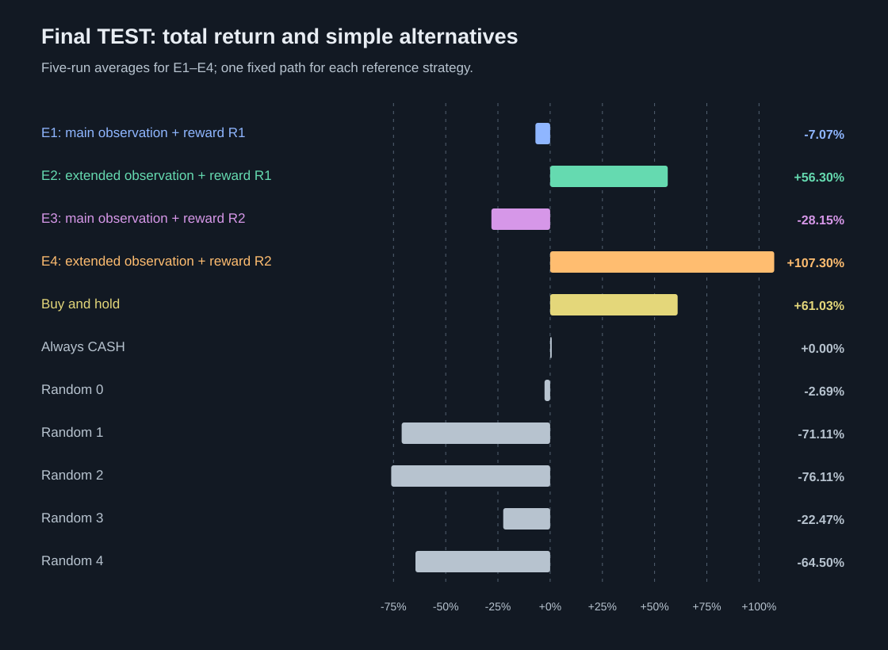
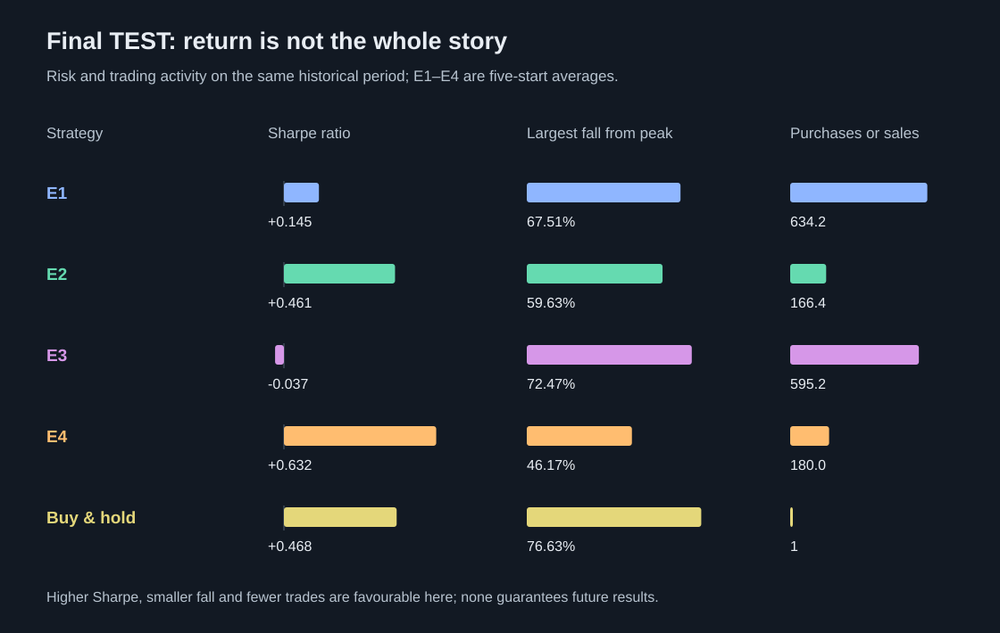
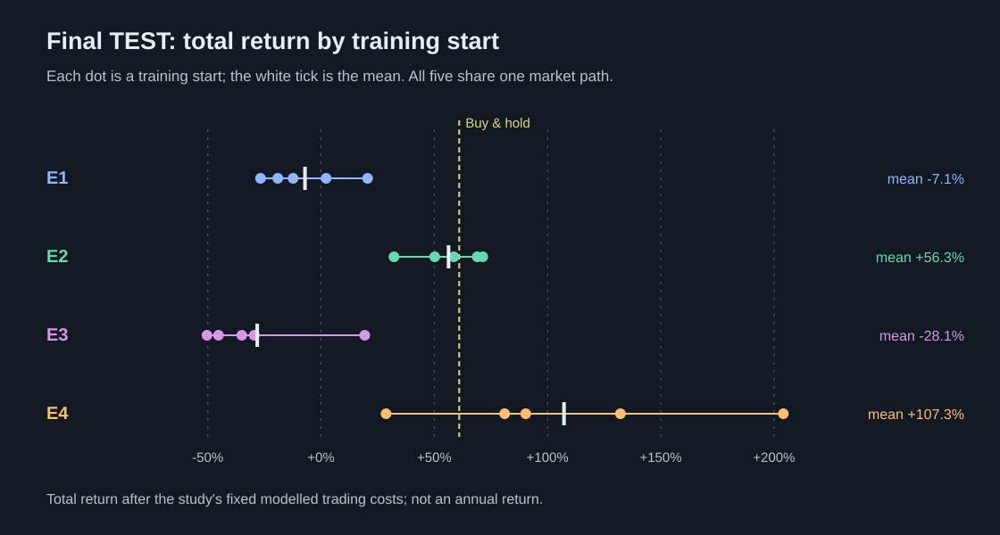
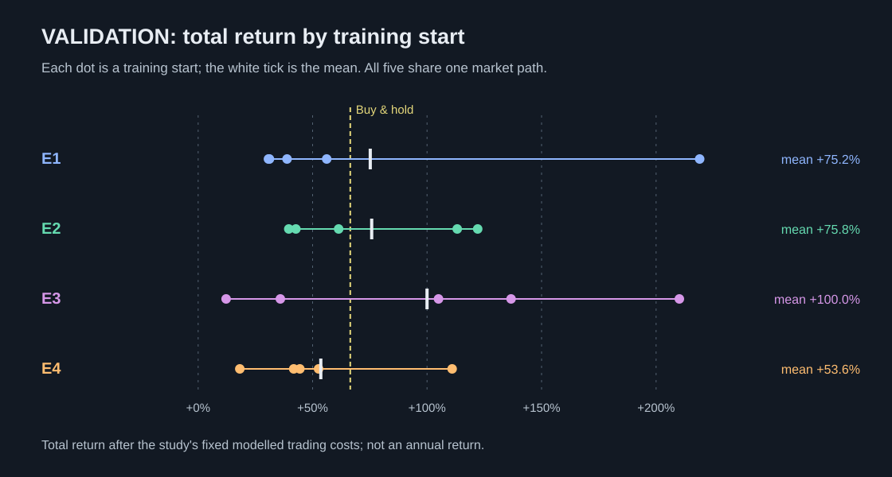
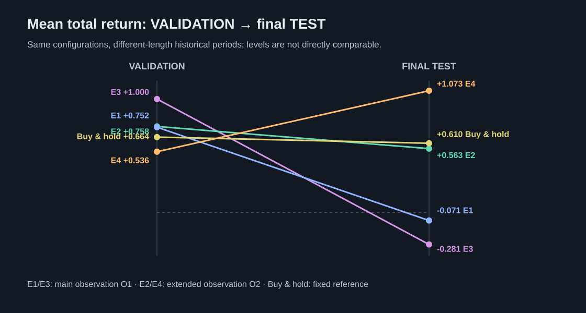
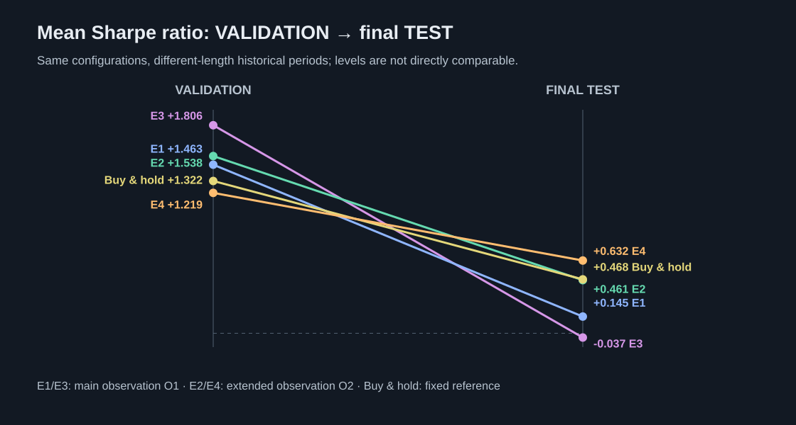
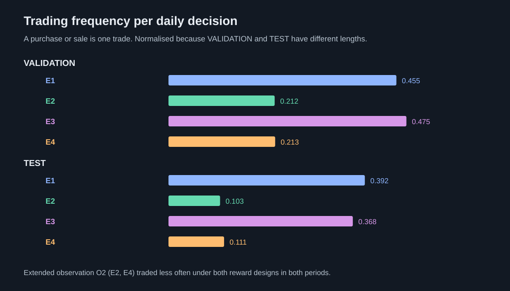
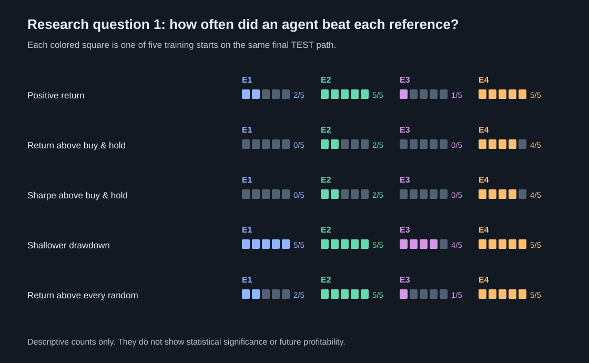
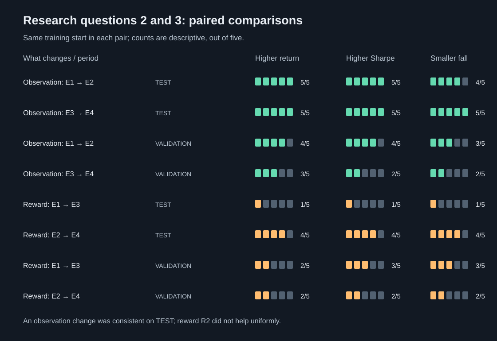

# Illustrated historical results

This page is a reading guide to the completed study. It contains static figures reconstructed from the numerical results in the [main README](../README.md#7-what-this-repository-contains-today), so the figures can be read on GitHub without the private study website, market dataset or disabled dashboard. The main README has the full tables, including all 20 individual training-start returns.

The figures describe **one historical Bitcoin spot-market path**, not a live investment system or a forecast. They do not establish that PPO is a reliable profitable investment method. Each figure is an illustration of the completed frozen evaluation; no experiment was rerun to draw it.

## Read this first

| Term | Meaning here |
| --- | --- |
| TRAIN | 4 March 2018–31 December 2020: the period in which the agents learned. |
| VALIDATION | 1 January–29 August 2021: a 239-decision development check. |
| Final TEST | 30 August 2021–4 February 2026: the 1,618-decision, one-time final assessment. |
| E1 | Main observation O1 (last 10 daily price changes) with reward R1 (portfolio growth after costs). |
| E2 | Extended observation O2 (eight price-derived indicators) with reward R1. |
| E3 | Main observation O1 with reward R2 (R1 plus trading and drawdown penalties). |
| E4 | Extended observation O2 with reward R2. |
| Training start or seed | One of five random initializations of the same design. The five agents use the same market path; they are not independent market samples. |
| Buy and hold | Buy once and remain invested; a fixed reference, not a trained agent. |

All returns shown here are **total returns over the named period after the study's modelled trading costs**, not annual returns. A purchase or sale is charged a modelled **0.10% trading fee plus 0.05% allowance for slippage** on the traded value. The return and risk values for E1–E4 are averages across five training starts unless a chart explicitly shows the individual runs. The charts do not include raw prices or day-by-day portfolio series.

## 1. What happened in the final TEST?

**How to read it.** A return of +107.30% for E4 means its mean final portfolio value was 2.073 times its starting value over the whole TEST period, *after* the modelled costs. It does not mean +107.30% per year. E4 had the highest mean among these examples, but the five E4 starts ranged from +28.73% to +204.14%. E1 and E3 had negative mean returns. Buy-and-hold gained +61.03%. The random strategies are deliberately simple reference points, not strategies being recommended.

**A return needs context.** The **Sharpe ratio** compares return with variation in daily returns; higher was better in this historical comparison, but it is not a promise of stable future returns. **Largest fall from peak** (maximum drawdown) measures how far portfolio value dropped below its previous high; smaller is better. E4's mean fall was still 46.17%, even though it had the strongest mean return. E1 and E3 traded hundreds of times, repeatedly paying the modelled fee and slippage allowance. A fractional number of trades is the *average* of five whole-number counts.

## 2. Did the five training starts behave alike?

Each dot is one separately initialized agent. The colored line joins the lowest and highest result within that experiment; the white tick is the mean. On final TEST, all five E2 and all five E4 starts had positive total return. E1 was positive in two of five, E3 in one of five. The wide E4 range warns against reading the mean as a typical or guaranteed outcome. The exact returns and start numbers are in the [main README table](../README.md#results-from-all-five-training-starts).

All 20 VALIDATION runs were positive, yet only 13 of 20 final TEST runs were positive. These are the *same designs* evaluated on later dates, not 20 separate markets. Five seeds measure sensitivity to training initialization on one market history; they do not provide a statistical confidence interval for future trading.

## 3. Why was a later TEST period important?

On VALIDATION, E3 was highest and E4 lowest by mean total return. On final TEST, E4 was highest and E3 lowest. The figure shows a **ranking reversal**, not an apples-to-apples comparison of cumulative returns: VALIDATION has 239 daily decisions and TEST has 1,618, across different market conditions. E3's +100.00% on VALIDATION cannot simply be subtracted from its −28.15% on TEST to measure deterioration per year.

Mean Sharpe ratios also declined from VALIDATION to TEST for all four agent designs and buy-and-hold. Different dates and conditions could contribute; this descriptive comparison does not identify a unique cause or prove a statistical effect. The final period was kept separate so the development ranking could be checked without changing the already frozen design.

## 4. What changed when the agent saw different information?

The extended observation O2 is E2 or E4; the main observation O1 is E1 or E3. O2 summarizes price changes, volatility, 50- and 200-day average-price comparisons, and a 14-day relative strength index. Both observations use **daily closing prices only**; neither contains volume, news, the calendar date or Bitcoin halving timing. The O2 agents traded less often than their O1 counterparts under either reward in both periods. Trading frequency is expressed per daily decision because the two periods have very different lengths.

Within the five *matched-start pairs* on final TEST, switching O1 to O2 gave higher return and higher Sharpe in all five pairs under either reward, and fewer trades in all five. VALIDATION was less consistent for return, especially under reward R2. This is evidence about these particular experiments and periods, not proof that any set of indicators will always help. The paired counts and return differences are in the [research-question table](../README.md#the-three-research-questions-in-numbers).

## 5. Did trained agents beat simple references?

Every square represents one of the five training starts within an experiment; the numbers at right show how many starts met the condition. For E4, four of five had a higher total return and Sharpe than buy-and-hold, and all five had a smaller maximum drawdown than buy-and-hold. Beating a random strategy is a weaker test than beating buy-and-hold. These counts are **descriptive** and not a statistical significance test.

## 6. Did changing the learning score help?

The upper four rows change only the observation (O1 to O2); the lower four change only the reward (R1 to R2), keeping each pair's training-start number the same. Each group of squares counts pairs with higher total return, higher Sharpe or a smaller maximum drawdown. Reward R2 was **not** a consistent improvement: with O1 on TEST, only one of five matched pairs improved on these measures; with O2, four of five did. Its trading penalty also did not reliably reduce the number of actual trades. The [full paired table](../README.md#the-three-research-questions-in-numbers) includes the trade and cost-drag comparisons and return differences in percentage points.

## What a reader can and cannot conclude

The completed historical study illustrates that the information supplied to a PPO agent mattered more consistently here than the modified reward: extended observation O2 was associated with fewer trades and less modelled cost exposure, and it outperformed O1 in the matched final TEST comparisons. The finding is limited to this design, five training starts and one historical market path. It is not evidence of a general, statistically established or future-profitable daily trading strategy. No live trading was performed.

For the study question, exact indicator definitions, fixed costs and evaluation safeguards, start with the [main README](../README.md). For technical details, see [methodology](../docs/methodology.md), [limitations](../docs/limitations.md) and [evidence provenance](../docs/evidence-provenance.md). The market dataset, model weights, machine-readable result reports and daily replay remain outside this repository, so those exact historical runs cannot be independently reproduced from this repository alone. The code and locked dependencies can be inspected, and the safe tests can be run without the dataset.
